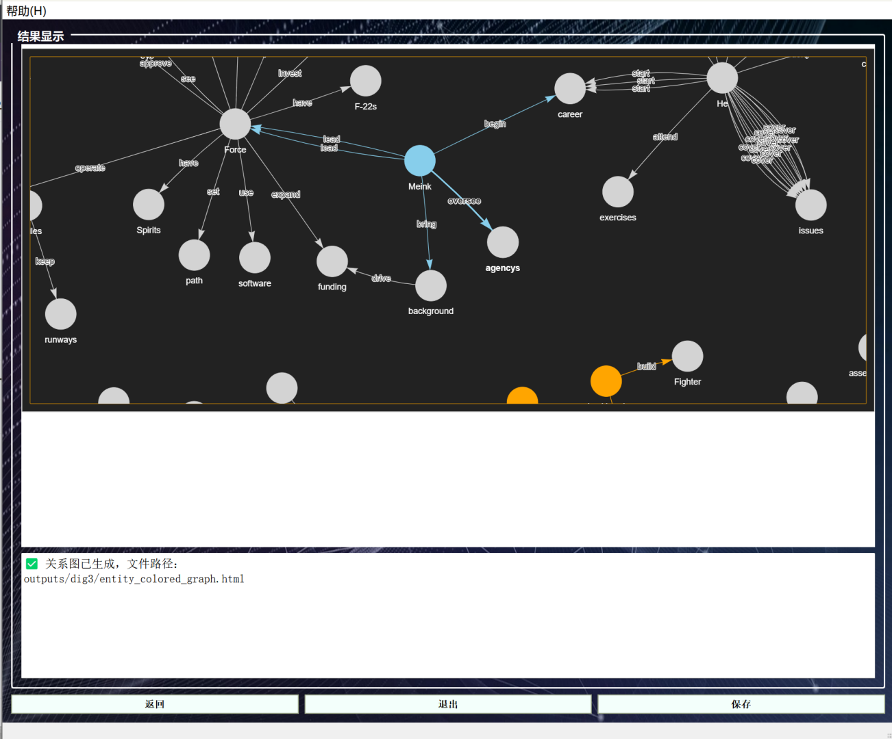
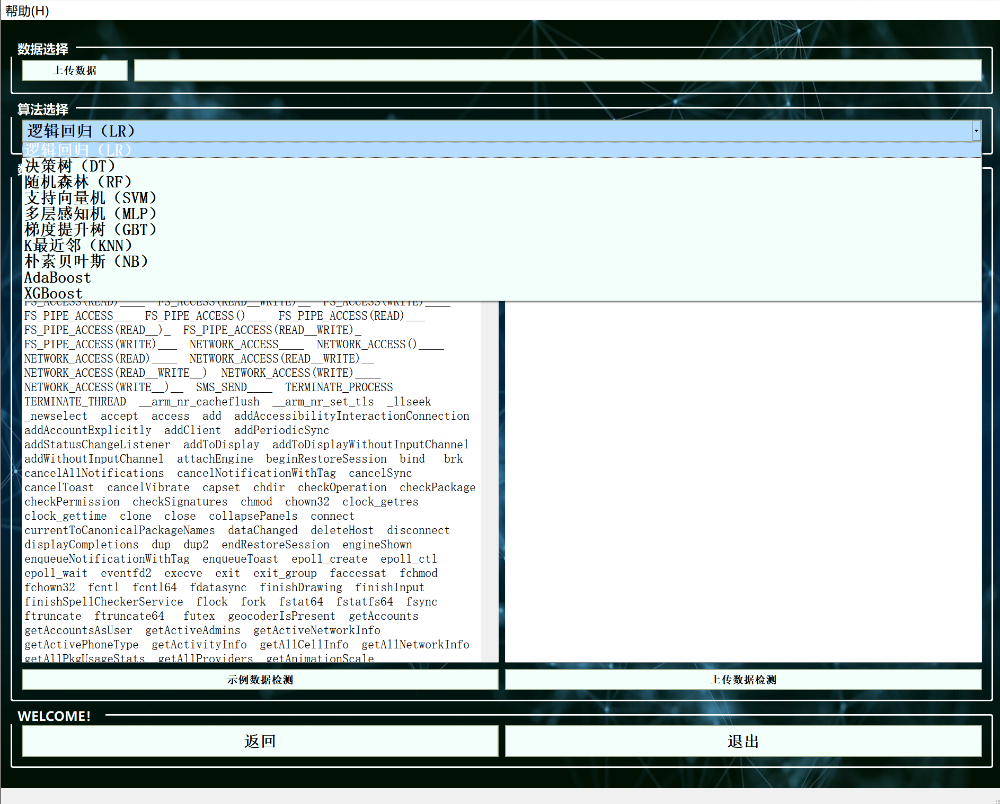

# 软件使用手册
### 一、软件简介

本软件数据挖掘与攻击检测系统，旨在为用户提供一套集成化的数据分析与 安全检测解决方案。系统分为“数据挖掘模块 ”和“攻击检测模块 ”，支持文本 数据的热词提取、聚类分析、时间线生成，以及基于多种机器学习算法的网络攻 击识别与分类检测。通过简洁直观的操作界面，用户可以轻松完成数据上传、算 法选择、结果分析与导出等全过程，广泛适用于数据探索、网络安全检测等应用 场景。

#### 1.1 软件名称

**SentinelMiner**

#### 1.2 版本号

**V1.0**

#### 1.3 编写日期

**2025 年 4 月**

#### 1.4 运行环境与安装说明

- 系统要求：Windows 10/11（x64）
- 安装环境：已将 Python 3.9 以及相关所需要用到的包封装至 `SentinelMiner.exe`，无需单独安装
- 依赖库：`PyQt5`，`pandas`，`Numpy`，`matplotlib`，`joblib`，`scikit-learn`，`spaCy` 等

#### 1.5 启动方式

- 双击 `SentinelMiner.exe`，无需安装，解压即用。

## 二、软件界面与功能模块介绍
#### 2.1  启动与主界面

##### 2.1.1 点击启动后，进入主界面

##### 2.1.2 鼠标悬浮在功能按钮上看显示其功能模块的介绍

##### 2.1.3 在未登陆前无法点击进入功能模块

##### 2.1.4 点击菜单栏下的帮助中的使用帮助文档，可以直接打开操作手册

#### 2.2 登录与注册界面

##### 2.2.1 在主页面中点击注册进入注册页面，输入账号以及两次密码即可成功注册，注册成功后直接跳转到登录界面

##### 2.2.2 在登录界面中使用已注册过的信息直接进行登录即可，无论程序打开几次，注册信息将会永久保存

##### 2.2.3 登录成功进入主要功能选择界面

总入口页面：本页面为软件主功能选择界面，在用户成功登录系统后自动进入。界面简洁清晰，引导用户选择不同的核心模块进行后续操作。 
页面整体布局
①左侧区域：
用户欢迎信息：显示当前登录用户欢迎语（如“欢迎您，33！”），确认身份。
②操作按钮：
【退出】：点击后直接退出登录，返回到登录页面或关闭程序。
③欢迎提示：
显示欢迎文本“WELCOME! ”以增强用户体验。
④中央区域：
功能说明区：页面上方设有空白的“功能说明 ”板块，当鼠标悬停在功能按钮上时，显示该功能的简要说明，帮助用户快速理解操作流程。
⑤下方区域：
功能选择区（核心）：布置了两个主要功能按钮，分别对应软件的两大主模块。点击按钮则进入相应的主功能页面。鼠标悬停可查看对应功能模块的简要介绍，便于选择。

#### 2.3 功能界面使用 1——数据挖掘

本页面为数据挖掘模块主界面，主要用于分类选择不同的数据分析与挖掘功
能。界面功能区域划分清晰，操作直观，具体说明如下： 
页面整体布局
①用户欢迎信息：显示当前登录用户的欢迎语，如“欢迎您，XXX！ ”。
②操作按钮：
【返回】：返回至主界面或上一级菜单。 
【退出】：直接退出软件或注销登录。
③中央区域：
分类说明：当鼠标悬停在不同功能按钮上时，此区域显示对应功能的简要说 明，辅助用户理解操作内容。
④下方区域：
分类选择区：提供六个核心功能按钮，支持不同类型的数据挖掘任务。点击 相应按钮，进入对应的功能子页面进行详细操作。
##### 2.3.1 信息真伪辨别
功能描述：基于上传文本数据，使用机器学习模型（如真假新闻检测模型） 自动判断信息内容的真实性与可靠性。适用场景：新闻真实性验证、社交媒体内 容甄别等。
##### 2.3.2 事件抽取和时间线建立
功能描述：对新闻文本或大段文字数据进行事件要素抽取（如事件时间、地 点、主体等），并按照时间顺序自动建立事件时间线。适用场景：重大事件追踪、 舆情演变分析。
##### 2.3.3 热点分析
功能描述：提取上传数据中的高频关键词，统计并绘制热词分布图，辅助用 户快速识别数据中的关注焦点和热门话题。适用场景：热点新闻分析、社交平台 舆情监控。
##### 2.3.4 文本聚类和主题跟踪
功能描述：基于文本内容特征，进行无监督聚类，自动识别数据中隐藏的主 题类别，并跟踪主题变化趋势。适用场景：大规模文本分类、主题演变追踪。
##### 2.3.5 基于文本内容的实体关系可视化提取器
功能描述：从文本中识别实体（如人名、机构、地点等）及其关系，生成可 视化的实体关系图谱，展示信息关联网络。适用场景：情报分析、舆情关系链挖 掘。

#### 2.4 功能界面使用2——攻击检测

本页面为攻击检测模块主界面，主要面向网络安全数据的分析与入侵检测， 支持多种场景下的威胁识别和分类。页面整体布局简洁，功能分类明确，具体说 明如下：
页面整体布局
①左侧区域：
用户欢迎信息：显示当前登录用户欢迎语（如“欢迎您，XXX！ ”）。
②操作按钮：
【返回】：返回至主界面或上一级页面。
【退出】：退出当前账号或关闭软件。
③中央区域：
分类说明区：鼠标悬停在不同功能按钮上时，此区域动态显示对应功能简介，指导用户操作。
④下方区域：
分类选择区：提供四个主要检测功能按钮，分别针对不同的安全检测需求设计。鼠标悬停在任一功能按钮上，可在中央说明区域查看该功能的简要操作指南。 点击相应按钮，进入对应检测子页面，执行数据上传、算法选择与结果分析。
##### 2.4.1 入侵攻击类型检测
功能描述：基于标准入侵检测数据集（如 KDD99、NSL-KDD、CICIDS 等）， 通过多种机器学习模型识别不同类型的攻击行为（如DDoS、扫描、暴力破解等）。 适用场景：企业网络安全监控、攻击溯源、异常流量识别。
##### 2.4.2 恶意代码检测
功能描述：通过对程序代码、文件或流量内容的特征提取，检测是否存在恶 意代码植入、病毒木马或可疑指令集。适用场景：软件供应链安全、病毒检测、 防止木马后门攻击。

## 三、数据挖掘功能模块详解

#### 3.1 数据挖掘功能 1——信息真伪辨别

本模块主要用于对文本数据中的信息进行真伪辨别，通过预训练的分类模型 预测每条数据的真实性，辅助用户快速甄别数据内容的可靠性。

##### 3.1.1 页面整体布局
左上方：【上传数据】按钮，可选择上传本地 CSV 格式的数据文件。 
上方中间：【示例数据】按钮，使用系统自带的标准测试数据。
中间区域：【数据展示】区，分别展示上传的数据或示例数据内容。
右上方：【查看数据】区，集中展示上传或示例数据的前 100 条记录。 
下方操作区：
【示例数据检测】：运行示例数据进行真伪分类检测。
【上传数据检测】：运行用户上传的数据进行真伪分类检测。
【返回】：返回上一层功能选择界面。 
【退出】：关闭程序。
##### 3.1.2 功能操作步骤
1.文件上传(也可点击示例数据，直接使用示例数据进行查看)
用户点击【上传数据】按钮，可选择本地 CSV 文件上传。支持文件格式：.csv。 上传的文件应符合模型要求的输入格式，例如包括清理好的文本列。
注意事项：上传的数据需为经过清洗、标准化处理的文本特征，避免格式错 误导致无法检测。

2.数据展示
成功上传或加载示例数据后，数据内容在界面中央的表格区域中展示。 默认显示前 100 条记录，方便用户快速检查数据正确性。
3.运行检测
点击【示例数据检测】按钮：
系统将自动加载示例数据，调用预训练的真假信息分类模型进行预测，并显示预 测结果。
点击【上传数据检测】按钮：
系统将对用户上传的数据进行模型预测，输出每条记录的真假判别结果。 检测完成后，界面自动跳转至结果展示页，包括以下内容：

1.预测结果（0 假，1 真）：每条数据的真假预测标签
2.分类报告（Classification Report）：准确率、召回率、F1 分数（如果示例数据中包含真实标签）
3.混淆矩阵（Confusion Matrix）：检测结果的分类分布情况

4.结果保存
在检测结果页面，用户可以点击【保存】按钮。系统支持将预测结果以 CSV 文件格式导出至本地。保存内容包括：每条数据的预测标签，可供后续分析使用。

5.返回重新检测
点击【返回】按钮，可以返回到数据上传与选择界面，重新上传新的数据或重新选择示例数据进行检测。无需重新启动程序，即可多轮测试，提高使用灵活性。

#### 3.2 数据挖掘功能 2——事件抽取和时间线建立

本模块主要通过自然语言处理技术，从文本数据中提取事件发生的时间信息，并构建完整的事件时间线；同时识别文本中的主体、动作与客体，生成实体关系图，辅助用户深入理解事件发展脉络及实体交互关系。

##### 3.2.1 页面整体布局
左上方：【上传数据】按钮，选择本地 CSV 格式数据文件。
上方中间：【示例数据】按钮，快速加载系统预置的新闻文本示例。
中间区域：【数据展示区】，显示上传或示例数据内容，便于检查数据结构。 
右上方：【查看数据区】，集中展示文件内容预览。
下方操作区：
【示例数据检测】：使用示例数据提取事件时间线与实体关系。
【上传数据检测】：处理用户上传的数据，提取时间线与关系图。
【返回】：返回上一功能模块页面。
【退出】：关闭程序。
##### 3.2.2 功能操作步骤
1.文件上传(也可点击示例数据，直接使用示例数据进行查看)
点击【上传数据】按钮，选择本地 .csv 格式文件。文件需包含至少一列文本内容字段（如 content），用于事件提取。注意事项：文本列要求内容完整， 避免出现大量空白或异常格式。
2.数据展示
成功上传或加载示例数据后，界面中央表格展示前 100 条数据记录，供用户快速核验数据正确性。
3.运行时间线提取与关系图分析
点击【示例数据检测】按钮：加载示例新闻数据，执行事件时间提取与实体关系提取，生成时间线和关系图。
点击【上传数据检测】按钮：
处理用户上传的文本数据，同样提取出各事件时间节点及实体交互关系。检测完成后，跳转至结果展示页面，并展示以下内容：
1.事件时间线表格:依照时间顺序列出各主要事件
2.时间线柱状图:展示不同日期发生事件的数量分布
3.实体关系图（NetworkX 绘制）:可视化各个实体之间的动作关系

4.结果保存
点击【保存】按钮，可将分析结果导出为 PDF 文件。保存内容包括：时间线表格（每个日期对应的事件数量）、时间线柱状统计图、实体交互关系图，便于后续归档、汇报或继续分析使用。

5.返回重新操作
点击【返回】按钮，可回到上传/选择界面，重新加载新的数据集进行事件时间线和关系抽取分析。支持反复使用，无需重启程序。

#### 3.3 数据挖掘功能 3——热点分析

本模块主要针对上传或示例文本数据，提取并统计文本中的高频关键词（Top 20 热词），通过表格与柱状图的形式直观展示数据热点，帮助用户快速洞察文 本集合中的关注焦点与内容分布特征。

##### 3.3.1 页面整体布局
左上方：【上传数据】按钮，可选择本地 CSV 格式数据文件。
上方中间：【示例数据】按钮，快速加载系统预置标准文本数据。
中间区域：【数据展示区】，用于显示上传或示例数据内容，便于初步检查。 
右上方：【查看数据区】，集中预览数据内容。
下方操作区：
【示例数据检测】：基于示例数据进行热词提取分析。
【上传数据检测】：基于用户自定义数据进行热词提取分析。
【返回】：返回上一功能模块选择页面。 
【退出】：关闭程序。
##### 3.3.2 功能操作步骤
1.文件上传(也可点击示例数据，直接使用示例数据进行查看)
点击【上传数据】按钮，选择本地 .csv 格式文件进行上传。文件需包含文本字段（如新闻正文、评论内容等），用于词频统计分析。注意事项：上传文件 建议预处理文本字段，去除乱码、无效数据，以确保提取效果。
2.数据展示
成功上传或加载示例数据后，界面中部表格展示前 100 条数据，帮助用户核验数据内容与结构正确性。
3.运行热词提取分析
点击【示例数据检测】按钮：
系统将加载示例文本数据，提取前 20 个高频关键词及其出现次数，并生成词频分布柱状图。

点击【上传数据检测】按钮：
系统将处理用户上传的数据集，执行相同的热词提取与分析流程。检测完成后，系统跳转至结果展示页面，并展示以下内容：
1.热词词频表:显示前 20 个关键词及其出现次数	
2.热词柱状图:以柱状图形式展示关键词出现频率（词-频次分布）	

4.结果保存
点击【保存】按钮，可以将分析结果导出为 PDF 文件。保存内容包括：热词词频表文本内容、热词分布柱状图，便于后续报告编写、数据分析归档使用。

5.返回重新操作
点击【返回】按钮，可回到上传数据页面，重新选择新的数据集进行热词提取分析。支持多次重复检测，无需重新启动程序。

#### 3.4 数据挖掘功能 4——文本聚类和主题跟踪

本模块主要基于文本内容特征，使用 TF-IDF 向量化和无监督聚类算法（如 KMeans）对文本进行自动分组，提取每个主题的关键词及代表性文章，辅助用户洞察数据的内在结构与主题演变趋势。

##### 3.4.1 页面整体布局
左上方：【上传数据】按钮，可选择上传本地 CSV 格式的数据文件。 
上方中间：【示例数据】按钮，快速加载系统预置的标准新闻数据。
中间区域：【数据展示区】，用于预览上传或示例数据的前 100 条记录。 
右上方：【查看数据区】，集中显示数据内容，辅助数据检查。
下方操作区：
【示例数据检测】：基于示例数据执行文本聚类分析。
【上传数据检测】：基于用户上传的数据执行文本聚类分析。 
【返回】：返回上一功能选择界面。
【退出】：关闭程序。
##### 3.4.2 功能操作步骤
1.文件上传(也可点击示例数据，直接使用示例数据进行查看)
用户点击【上传数据】按钮，选择本地 .csv 文件上传。上传的数据应包含待聚类的文本信息字段，例如新闻标题、文章内容等。注意事项：文件格式需规 范，建议文本列经过基本清洗处理，确保能正确进行特征提取。
2.数据展示
成功上传或加载示例数据后，系统自动显示数据表格，预览前 100 条记录，方便用户验证数据是否符合要求。
3.运行聚类检测
点击【示例数据检测】按钮：
系统读取示例数据，使用 TF-IDF 特征提取与 KMeans 聚类算法，将文本分为 4个主题簇，提取各主题关键词及代表性文章。
点击【上传数据检测】按钮：
对用户自定义上传数据执行相同聚类流程， 自动输出分析结果。 
检测完成后，界面跳转至结果展示页面，包括以下内容：
1.每个聚类的关键词列表:显示每个主题最具代表性的关键词	
2.每个聚类下的代表性文章标题:展示主题内的主要文章	
3.聚类分布柱状图:可视化各聚类中文档数量分布情况	

4.结果保存
在聚类结果页面，点击【保存】按钮。系统支持将分析结果保存为 PDF 文件，文件中包含：文本摘要（每个聚类的关键词和文章标题）、聚类数量分布图 （柱状图）、保存路径自定义，便于后续报告撰写或数据留档。

5.返回重新检测
点击【返回】按钮，可回到上传与选择界面，重新选择新的数据集进行聚类分析。支持多轮实验，无需重新启动程序。

#### 3.5 数据挖掘功能 5——基于文本内容的实体关系可视化提取器

本模块基于自然语言处理（NLP）技术，从上传或示例文本数据中提取主语- 动词-宾语（SVO）结构及命名实体识别（NER）信息，构建实体关系网络，并生成交互式可视化图谱，帮助用户直观理解文本中各实体间的关联关系。

##### 3.5.1 页面整体布局
左上方：【上传数据】按钮，可选择本地 CSV 格式文本数据。
上方中间：【示例数据】按钮，快速加载系统预置文本示例。
中间区域：【数据展示区】，显示上传或示例数据内容，供用户初步检查。
右上方：【查看数据区】，集中预览文本数据。
下方操作区：
【示例数据检测】：基于示例数据提取实体关系并生成可视化图谱。
【上传数据检测】：基于用户上传的数据提取实体关系并生成可视化图谱。 
【返回】：返回上一功能模块选择界面。
【退出】：关闭程序。
##### 3.5.2 功能操作步骤
1.文件上传
点击【上传数据】按钮，选择本地 .csv 文件上传。上传的文件需包含至少一列文本字段（如 content），用于实体与关系抽取。
注意事项：文本内容应尽量清晰、规范，以提升实体识别和关系抽取的准确率。

2.数据展示
成功上传或加载示例数据后，界面中央表格展示前 100 条记录，便于用户快速核查数据内容。
3.运行实体关系提取与可视化 点击【示例数据检测】按钮：
系统将处理示例数据，提取实体与动宾关系，并生成交互式实体关系图。点击【上传数据检测】按钮：
系统将处理用户上传数据，同样提取实体关系并生成可视化图谱。 检测完成后，系统跳转至结果展示页面，内容包括：
1.关系图生成路径提示：显示生成的 HTML 文件保存路径
2.关系图可视化展示：直接在界面中嵌入并浏览实体关系交互图（支持缩放、拖拽等操作）
3.节点含义：节点代表不同实体（如人物、机构、地名等），颜色根据实体类 型分类。
4.边含义：边代表两个实体之间的动作关系（动词作为边标签）。

4.结果保存
点击【保存】按钮，可以将生成的 HTML 格式的交互式关系图保存到本地。保存后用户可以独立浏览该图谱，支持离线打开，不依赖外部服务器。

5.返回重新操作
点击【返回】按钮，可回到上传与选择页面，重新上传新的数据进行实体关 系提取和可视化。
支持多轮检测与图谱生成，无需重启程序。

## 四、攻击检测功能模块详解

#### 4.1 攻击检测功能 1——入侵攻击类型检测

本模块针对网络流量或系统调用特征数据，通过选择不同的机器学习分类模型，对上传或示例测试数据进行攻击类型检测与分类，辅助用户识别潜在入侵行 为及异常流量模式，提升网络环境和系统安全性。

1.文件上传
用户点击【上传数据】按钮，选择本地 .csv 格式文件上传。也可以点击【示例数据】按钮，加载系统提供的标准测试数据。注意事项：上传数据应包含提取 好的特征向量，且字段应与模型训练要求保持一致（如无缺失值、标准化处理）。
2.选择检测算法
本模块支持用户根据需要，在多个训练好的分类模型中自由选择进行检测，目前支持的模型算法包括：
1.逻辑回归（LR）：线性分类模型，适合处理二分类和多分类任务，计算速度快，适用于简 单数据场景。
2.决策树（DT）：基于特征划分规则构建分类决策树，适用于数据分布复杂或特征关联明 显的情况。
3.随机森林（RF）：集成多棵决策树形成的强分类器，具有较强的抗过拟合能力，适用于大 规模特征数据。
4.支持向量机（SVM）：基于最大间隔分类原理，适合复杂小样本分类，支持高维数据处理。
5.多层感知机（MLP）：基于神经网络的分类器，能够建模复杂非线性关系，适用于特征高度复杂的数据集。
6.梯度提升树（GBT）：基于梯度提升的集成方法，逐步优化分类效果，适合处理难以线性分割 的数据。
7.K最近邻（KNN）：基于距离度量的实例学习方法，适用于样本量适中、特征空间规则的数据。
8.朴素贝叶斯（NB）:基于特征独立性假设的概率分类器，训练速度快，适合初步分类或文本 数据场景。
9.AdaBoost:基于加法模型与迭代优化的集成方法，能有效提升弱分类器性能。

10.XGBoost:性能优异的梯度提升优化框架，训练速度快，准确率高，适用于大规模分类问题。
用户在界面下拉菜单中选择目标算法后，即可进行检测。
3.数据展示
成功上传或加载示例数据后，界面表格展示前 100 条数据记录，供用户核查数据完整性与特征结构。
4.运行检测与结果查看
点击【运行检测】按钮，系统将使用选择的模型，对上传或示例测试数据进行攻击类型分类预测。检测完成后，系统跳转至结果展示页面，输出以下内容：
1.预测类别表:每条测试数据的攻击类型分类结果
2.预测类别频次柱状图:各攻击类型类别数量分布的可视化统计

5.结果保存与返回操作
点击【保存】按钮，可将检测结果（预测表格和频次统计图）导出为 PDF 文件，供后续报告归档或进一步分析使用。
点击【返回】按钮，可返回上传页面，重新选择数据或检测算法进行新的测试。

#### 4.2 攻击检测功能 2——恶意代码检测

本模块针对上传或示例的程序行为特征数据（如系统调用频率特征等），
通过灵活选择不同的机器学习或集成学习算法，对数据进行分类检测，辅助用户识别潜在的恶意代码样本，包括病毒、木马、勒索软件等威胁。
1.文件上传
用户点击【上传数据】按钮，选择本地 .csv 格式的数据文件。或点击【示例数据】按钮，加载系统提供的标准测试数据。注意事项：上传数据需包含提取 好的特征向量，例如系统调用频率矩阵，且字段格式规范完整。不需要包含标签 列，系统会自动处理输入特征。

2.选择检测算法
本模块支持多种分类与集成算法，用户可根据需要在界面下拉菜单中自由选择模型，
当前支持的检测算法包括：
1.随机森林（Random Forest）：集成多棵决策树，抗过拟合能力强，适合大规模特征数据分 类。
2.K 最近邻（KNN）：基于特征距离度量，适用于小样本、特征分布规则的数据分类。
3.决策树（Decision Tree）：基于特征划分的分类方法，规则透明，便于理解和可视化。
4.XGBoost：高性能梯度提升决策树框架，训练速度快，分类效果优异。
5.梯度提升（Gradient Boosting）：基于提升树集成方法，逐步优化分类性能。
6.逻辑回归（Logistic Regression）：线性二分类器，适合初步快速分类与可解释性要求高的场景。
7.KMeans+随机森林（KMeans+RF）：先聚类后分类的组合策略，适合数据存在隐含分群结构时的 分类问题。
8.DBSCAN+随机森林（DBSCAN+RF）:先基于密度聚类再进行随机森林分类，适合噪声较多的数据集。
9.投票集成（Voting Ensemble）:多模型预测结果投票融合，提高整体稳定性和准确率。
10.堆叠集成（Stacking Ensemble）:多模型堆叠融合，综合多个分类器优势，实现更高检测性能。
3.数据展示
成功上传或加载示例数据后，界面中部表格展示前 100 条数据，供用户快速查看数据内容。

4.运行检测与结果查看
用户在选择好检测算法后，点击【运行检测】按钮。系统自动调用对应模型 进行预测检测，并在结果展示页面输出以下内容：
1.预测结果表：显示每条测试数据的分类预测标签
2.标签频次柱状图：统计各个预测类别出现的数量，生成可视化柱状图

5.结果保存与返回操作
点击【保存】按钮，可以将检测结果（预测标签和频次统计图）导出为 PDF 文件。
点击【返回】按钮，可以回到检测主界面，重新上传新的数据或重新选择检 测算法进行再次测试。

	
